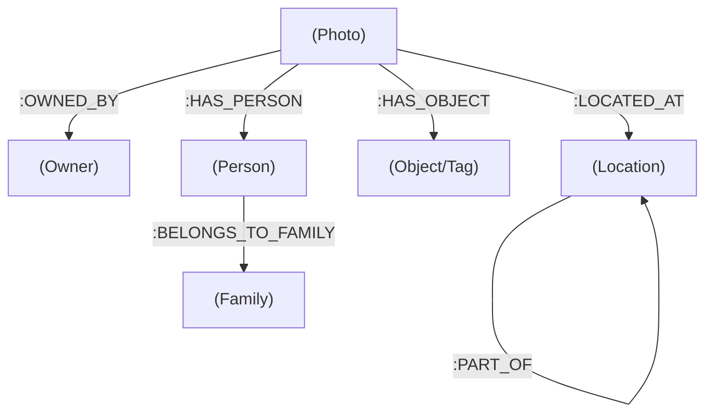

# Graph Database Schema (LPG)

This document describes the Labeled Property Graph (LPG) structure used in the Graph Database (Memgraph/Neo4j). The schema follows the **POLE+O** model (Person, Object, Location, Event + Owner).

## Visual Overview

## Node Labels

### `Photo` (The Anchor)
Represents a single media item (image or video).
- **Properties:**
  - `id`: Unique identifier from Synology (unit_id).
  - `filename`: Name of the file.
  - `folder`: Path to the file on the NAS.
  - `latitude`: GPS Latitude (if available)
  - `longitude`: GPS Longitude (if available)
  - `takentime`: Unix timestamp (source: `unit.takentime`)
  - `takentime_iso`: Human-readable ISO date
  - `cache_key`: Key used to access thumbnails (source: `unit.cache_key`).

### `Person`
Represents a person identified in a photo.
- **Properties:**
  - `name`: Full name of the person.

### `Family`
Extracted entity grouping persons by their last name.
- **Properties:**
  - `name`: The last name/family name.

### `Object`
Represents AI-detected tags or general tags.
- **Properties:**
  - `name`: The tag label (e.g., "Cat", "Landscape").

### `Location`
Represents a geographical entity (hierarchical).
- **Labels (Multi-label):** `:Location` and one of `:Country`, `:State`, `:County`, `:City`, `:Street`.
- **Properties:**
  - `name`: Name of the location part.
  - `type`: Type descriptor (e.g., "City").
  - `level`: Synology hierarchy level (source: `address.admin`).
  - `index`: Position in the address hierarchy.

### `Owner`
Represents the user who owns the media item.
- **Properties:**
  - `name`: The owner's name.

## Relationships

| Relationship | From | To | Description |
|--------------|------|----|-------------|
| `:OWNED_BY` | `Photo` | `Owner` | Links a photo to its owner. |
| `:HAS_PERSON` | `Photo` | `Person` | Links a photo to identified people. |
| `:HAS_OBJECT` | `Photo` | `Object` | Links a photo to detected tags/objects. |
| `:LOCATED_AT` | `Photo` | `Location` | Links a photo to its most specific location. |
| `:BELONGS_TO_FAMILY` | `Person` | `Family` | Groups people into families based on last name. |
| `:PART_OF` | `Location` | `Location` | Creates a geographical hierarchy (e.g., Street -> City -> Country). |
